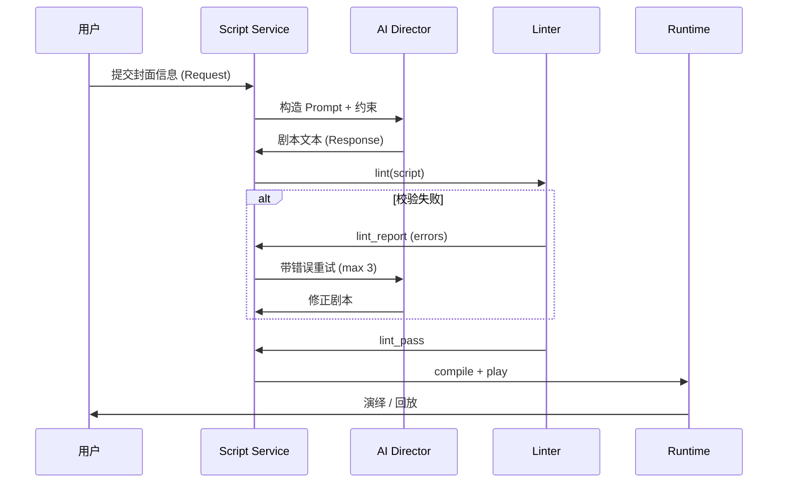

# L6 — AI 接口契约

> 版本：0.1.0 · 依赖：L2, L3, L4

定义用户 → AI → 程序 的完整数据流与校验反馈循环。

---

## 1. 总体流程



---

## 2. 输入 Request

### 2.1 HTTP 端点（草案）

```
POST /api/v1/scripts/generate
Content-Type: application/json
```

### 2.2 Request Body

```json
{
  "script_meta": {
    "title": "雨夜的告白",
    "theme": "温情",
    "synopsis": "雨夜广场，米拉与陈伯的故事……",
    "tone": "治愈",
    "tags": ["爱情", "小镇"],
    "max_duration_sec": 120,
    "language": "zh-CN"
  },
  "constraints": {
    "dsl_version": "1.0",
    "catalog_version": "1.0.0",
    "allowed_actors": ["mira", "old_chen", "lily"],
    "allowed_scenes": ["plaza", "cafe_interior"],
    "required_elements": {
      "min_actors": 2,
      "min_camera_cuts": 1,
      "min_dialogue_blocks": 2
    }
  },
  "catalog_snapshot_id": "entities-1.0.0"
}
```

### 2.3 字段约束

| 字段 | 规则 |
|------|------|
| `title` | 1–50 字 |
| `theme` | 1–20 字 |
| `synopsis` | 20–500 字 |
| `max_duration_sec` | 30–300 |
| `allowed_actors` | 须为目录子集；空=全部 |
| `required_elements` | 可选；用于生成后额外校验 |

---

## 3. 输出 Response

### 3.1 成功

```json
{
  "status": "ok",
  "script_id": "yu-ye-de-gao-bai-a3f2c1d8",
  "script_text": "---\ntitle: 雨夜的告白\n...\n---\n\n@BEGIN ...",
  "lint_report": {
    "passed": true,
    "warnings": [],
    "errors": []
  },
  "metadata": {
    "duration_estimate": 90,
    "cast": ["mira", "old_chen"],
    "scenes": ["plaza"],
    "acts": 2,
    "ai_retries": 0
  }
}
```

### 3.2 失败（Linter 仍不通过）

```json
{
  "status": "lint_failed",
  "lint_report": {
    "passed": false,
    "errors": [
      {
        "code": "E_OUT_OF_BOUNDS",
        "line": 28,
        "message": "坐标 (40, 5) 超出 plaza 地图范围",
        "suggestion": "plaza 有效范围 x∈[0,31.2], y∈[0,22.4]（考虑 mira 碰撞盒）"
      }
    ],
    "warnings": []
  },
  "ai_retries": 3
}
```

---

## 4. System Prompt 结构

Prompt 由以下部分拼接（模板文件：`prompts/director-system.md`）：

```
1. 角色定义：你是米拉小镇的剧本导演 AI
2. 铁律：只输出 .mira 格式；只用 DSL 指令；不输出解释文字
3. 附件：L3 指令表摘要（非全文，控制 token）
4. 附件：当前 catalog 可用 actor/scene/prop 列表
5. 附件：一个 minimal 示例（examples/minimal-play.mira）
6. 用户 Request JSON
7. 输出格式要求：仅 ```mira 代码块包裹的完整剧本
```

### 4.1 重试 Prompt（校验失败时）

```
你上一次输出的剧本未通过校验。请根据以下错误修正，只输出修正后的完整剧本：

{lint_report.errors 格式化列表}

原始 Request：
{request_json}
```

### 4.2 生成参数

| 参数 | 值 |
|------|-----|
| temperature | 0.7（首次）/ 0.4（重试） |
| max_tokens | 4096 |
| max_retries | 3 |

---

## 5. Linter 规则实现优先级

| 阶段 | 检查项 |
|------|--------|
| P0 语法 | front matter 解析、指令格式、块闭合 |
| P0 目录 | actor/scene/prop/preset 存在性 |
| P0 空间 | 坐标越界、zone 合法性 |
| P1 语义 | cast 一致性、actor 在场、并行冲突 |
| P1 约束 | `required_elements`、`max_duration_sec` |
| P2 风格 | `W_UNUSED_CAST`、`W_LONG_DIALOGUE` |

---

## 6. 程序检索 API（剧本库）

```
GET /api/v1/scripts?q=雨夜&cast=mira&scene=plaza
GET /api/v1/scripts/{script_id}
POST /api/v1/scripts/{script_id}/play
```

### 6.1 搜索参数

| 参数 | 说明 |
|------|------|
| `q` | 标题/简介/标签全文搜索 |
| `cast` | 角色 ID |
| `scene` | 场景 ID |
| `theme` | 主题 |
| `tag` | 标签 |

---

## 7. 安全与边界

| 规则 | 说明 |
|------|------|
| AI 无运行时 API | AI 不能调用 `/play`、不能改实体目录 |
| 输出消毒 | 剥离 prompt 注入；剧本不含 `<script>` |
| 目录外实体 | 默认拒绝；`allow_catalog_extension: false` |
| 体积限制 | 生成文本 ≤ 64 KB |

---

## 8. 错误码（API 层）

| HTTP | code | 说明 |
|------|------|------|
| 400 | `INVALID_REQUEST` | Request 字段不合法 |
| 422 | `LINT_FAILED` | 3 次重试后仍失败 |
| 503 | `AI_UNAVAILABLE` | AI 服务超时 |
| 200 | `ok` | 成功 |
