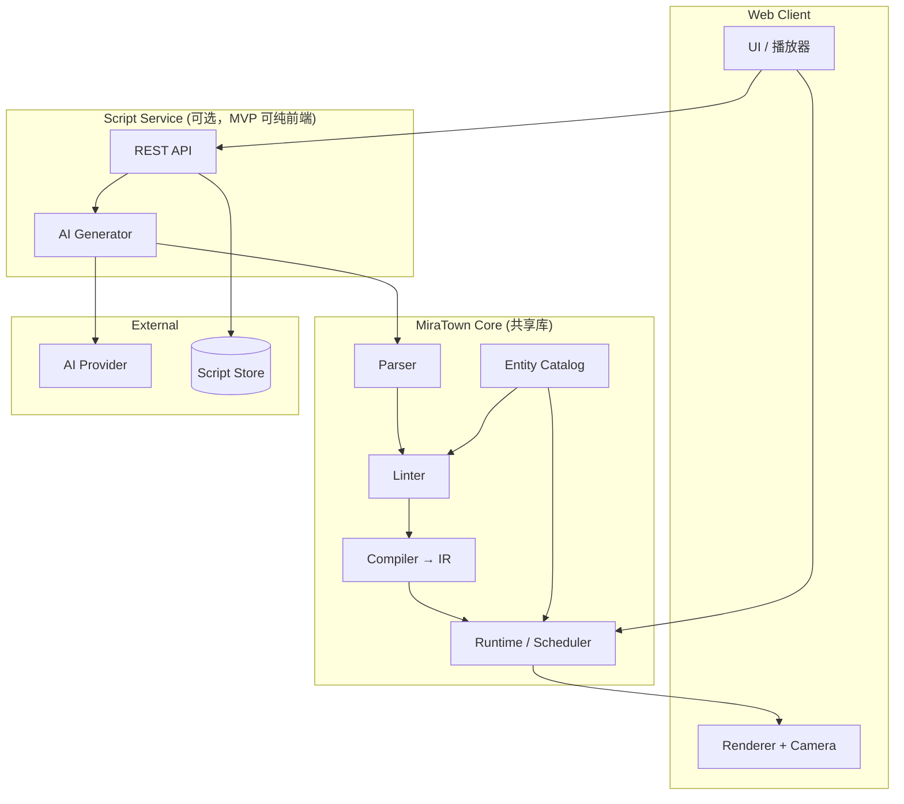

# L7 — 技术架构

> 版本：0.1.0 · 依赖：L5, L6

---

## 1. 模块总览



---

## 2. 模块职责

| 模块 | 职责 | MVP 技术选型（建议） |
|------|------|---------------------|
| **Parser** | `.mira` → AST | TypeScript + 手写递归下降 |
| **Linter** | AST + Catalog → 报告 | TypeScript |
| **Compiler** | AST → IR 树 | TypeScript |
| **Runtime** | IR 调度、状态机 | TypeScript |
| **Renderer** | 世界状态 → Canvas/WebGL | **PixiJS**（已决，ADR-003） |
| **Camera** | 世界坐标 → 视口变换 | Runtime 子模块 |
| **Catalog** | 加载 `entities.yaml` | YAML parser |
| **AI Generator** | Prompt 组装、重试 | OpenAI 兼容 API |
| **Script Store** | 剧本 CRUD、索引 | **浏览器 localStorage**（MVP） |
| **Web UI** | 封面表单、播放器、剧本文本编辑 | React + Vite |

---

## 3. 仓库结构（规划）

```
MiraTown/
├── catalog/
│   └── entities.yaml          # L2 实体目录
├── docs/                        # 设计文档 L0–L7
├── examples/
│   └── minimal-play.mira        # 参考剧本
├── packages/
│   ├── core/                    # parser, linter, compiler, runtime
│   │   └── src/
│   ├── renderer/                # 渲染与摄像机
│   └── web/                     # 前端应用
├── prompts/
│   └── director-system.md       # AI system prompt 模板
├── scripts/                     # 用户剧本库存放
└── README.md
```

---

## 4. 数据流

```
1. 用户填写封面 → Request JSON
2. AI Generator 调用 LLM → 原始文本
3. 提取 ```mira 块 → Parser → AST
4. Linter(AST, Catalog) → Report
5. 若 pass → Compiler(AST) → IR
6. Runtime.load(IR) → 每 tick 更新 WorldState
7. Renderer.draw(WorldState, CameraState) → 画面
8. EventLog 写入 → 支持回放
```

---

## 5. MVP 切片（实施顺序）

| 切片 | 交付物 | 依赖 |
|------|--------|------|
| **S0 无 AI 播放** | 加载 `minimal-play.mira` 或粘贴剧本 → lint → play | L3, L4 |
| **S1 核心解析** | Parser + Linter 对 `minimal-play.mira` 通过 | S0, catalog |
| **S2 运行时** | 无渲染的 headless Runtime，打印事件日志 | L5 |
| **S3 渲染** | PixiJS：广场 + 2 角色 + 跟随镜头，1280×720 letterbox | L1, renderer |
| **S4 完整演绎** | 播放 `minimal-play.mira` 全流程 | S1–S3 |
| **S5 AI 接入** | 封面四字段 → AI → lint → play 闭环 | L6 |
| **S6 剧本库** | localStorage 搜索、列表、重播 | L6 §6 |

### MVP 不包含

- 用户注册/登录
- 在线多人
- 剧本可视化编辑器
- 移动端适配
- `@ACT` 章节跳转（v0.2）
- beat 时间轴、斜向移动、多语言（v0.2+）

---

## 6. 核心接口（TypeScript 草案）

```typescript
// packages/core
interface Parser {
  parse(source: string): ScriptAST;
}

interface Linter {
  lint(ast: ScriptAST, catalog: Catalog): LintReport;
}

interface Compiler {
  compile(ast: ScriptAST): IRNode;
}

interface Runtime {
  load(ir: IRNode): void;
  tick(dt: number): WorldState;
  getEventLog(): Event[];
  onComplete: () => void;
}

// packages/renderer
interface Renderer {
  draw(state: WorldState, camera: CameraState): void;
  resize(w: number, h: number): void;
}
```

---

## 7. 部署（MVP，ADR-003）

| 组件 | 部署 |
|------|------|
| Web + Core + Renderer | 静态站点（Vercel / GitHub Pages） |
| AI 代理 | Serverless Function（隐藏 API Key） |
| 剧本存储 | **浏览器 localStorage** |
| 无 AI 模式 | 纯前端：示例剧本 + 粘贴 + 本地 lint/play |

---

## 8. 测试策略

| 层级 | 方法 |
|------|------|
| Parser | 快照测试 + 非法输入 |
| Linter | 每条错误码至少一个 fixture |
| Runtime | headless tick 对比事件日志黄金文件 |
| E2E | 播放 `minimal-play.mira` 截图对比（可选） |
| AI | Mock LLM 返回固定剧本，测闭环 |

---

## 9. 与文档的一致性

实现前须确认：

- [ ] `catalog/entities.yaml` 与 L2 同步
- [ ] Linter 错误码与 L3 §5 一致
- [ ] Runtime 默认值与 L5 §3 一致
- [ ] API 字段与 L6 §2 一致
